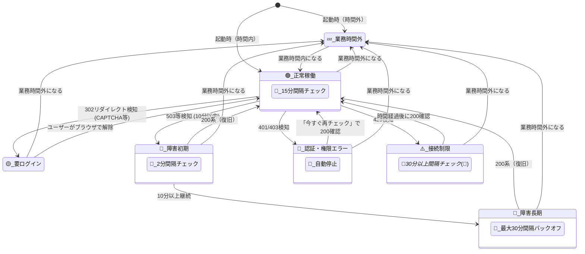

# 汎用サービス・経路チェッカー拡張機能「ServiceRoute-Solo」基本設計・仕様書

## 1. 概要

「ServiceRoute-Solo」は、ブラウザから社内外の各種Webサービス（Jira, Confluenceなどのオンプレミス/データセンター版、またはパブリッククラウドサービス）への可用性と接続経路を、ユーザー視点で監視・特定するためのChrome拡張機能である。

外部の監視サーバーを一切介さず、ユーザーのブラウザコンテキスト（Cookie/セッション）を利用してローカルスタンドアロンで動作し、インフラ負荷の軽減とユーザーの自己解決の促進を両立する。

## 2. コア・バリュー

- **障害原因の即時切り分け:** 「サーバーダウン」か「プロキシ（proxy.pac）の不調」か「認証/権限切れ」かをユーザー手元で10秒以内に特定。
- **無駄な負荷の徹底排除:** 状態に応じた可変ポーリングと業務時間外のスリープにより、ターゲットサーバーや社内インフラへの不要なトラフィックを発生させない。
- **高水準の汎用性とプライバシー:** `optional_host_permissions` を活用し、機密性の高い社内ネットワーク（プライベートクラウド、オンプレミス環境）のURLも安全に動かせる完全ローカル動作。

## 3. 主要機能要件

### ① 動的なターゲットURL管理と権限承認

- ユーザーは、監視したい任意のサービスの「表示名」「ベースURL」「認証切れ検知キーワード（任意）」を設定画面から自由に追加・削除できる。
- URL追加時、Chromeの `chrome.permissions` APIを介して、そのドメインに対するアクセス権限をユーザーに動的承認（プロンプト表示）させる。

### ② SSO（シングルサインオン）対応セッション共有

- 拡張機能からの生存確認（`fetch`）は、通常のブラウザタブとCookieおよびセッションストアを完全に共有する。
- ユーザーがWebブラウザ上のいずれかのタブで一度SSOログインを完了すれば、拡張機能側での追加の認証処理なしで正常（HTTP 200）と判定される。

### ③ アダプティブ・ポーリング（確認間隔の可変制御）

- システムや認証の状態、およびユーザーの業務時間設定（時間帯）に応じて、バックグラウンドでのリクエスト間隔を動的に変化させる。

### ④ 問題発生起点の可視化（タイムスタンプ管理）

- 各サービスが「正常」から「異常」に遷移した最初の時刻（`failureSince`）を保持し、ポップアップ上に「〇分前から継続中」と相対時間で明示する。

---

## 4. 状態遷移および挙動判定マトリクス

### 4.1 状態遷移図 (Mermaid)



### 4.2 挙動判定マトリクス

拡張機能のバックグラウンド処理は、`fetch` レスポンスに基づいて以下の状態に分岐し、確認間隔の変更とUIへの状態反映を行う。

| 検知した状態                | 判定条件                                                                                       | 次の確認間隔         | UI表現 | ユーザーへのメッセージ・対応策                                                                     |
| :-------------------------- | :--------------------------------------------------------------------------------------------- | :------------------- | :----: | :------------------------------------------------------------------------------------------------- |
| **🟢 正常稼働**             | HTTP 200〜300系、かつリダイレクトなし                                                          | **通常（15分）**     |   🟢   | 正常稼働中                                                                                         |
| **🟡 要ログイン (CAPTCHA)** | `response.redirected === true` かつ最終URLに設定されたキーワード（`login`, `sso`等）が含まれる | **通常（15分）**     |   ⚠️   | 要ブラウザログイン（直接サービスにアクセスして解除してください）                                   |
| **🔴 障害初期**             | HTTP 502 / 503 / 504（検知から10分以内）                                                       | **短縮（2分）**      |   ❌   | サーバー高負荷・ダウン（〇分前から）                                                               |
| **🔴 障害長期**             | HTTP 502 / 503 / 504（検知から10分以上継続）                                                   | **拡大（最大30分）** |   ❌   | 障害継続中（サーバー保護のためチェック頻度を下げています）                                         |
| **🔑 認証・権限エラー**     | HTTP 401 (Unauthorized) / HTTP 403 (Forbidden)                                                 | **停止（手動待ち）** |   🚫   | 設定・トークンを確認してください。ポップアップ内の**【今すぐ再チェック】**ボタン押下で確認を再開。 |
| **⚠️ 接続制限**             | HTTP 429 (Too Many Requests)                                                                   | **最長（30分〜）**   |   🐢   | 接続一時制限中（サーバー保護のため確認間隔を引き延ばしています）                                   |
| **💤 業務時間外**           | ユーザーが設定した時間帯（デフォルト 9:00〜18:00、土日オフ）の枠外                             | **停止**             |   💤   | スリープモード（業務時間外のため自動チェックを停止中）                                             |

---

# Appendix：実装詳細・技術ガイド（付録）

Julesがコードを生成する際の技術的アプローチ、および具体的なAPI活用方法についてのガイドライン。

### A.1 動的権限付与の実装アプローチ

`manifest.json` では特定のホストを許可せず、`optional_host_permissions` を使用する。

```json
{
  "manifest_version": 3,
  "name": "ServiceRoute-Solo",
  "version": "1.0.0",
  "permissions": ["storage", "idle"],
  "optional_host_permissions": ["http://*/*", "https://*/*"],
  "background": {
    "service_worker": "background.js"
  }
}
```

ユーザーが設定画面でURLを追加した際、以下のJavaScriptコードを用いて動的に権限を要求する。

```javascript
chrome.permissions.request(
  {
    origins: [newURL],
  },
  (granted) => {
    if (granted) {
      // storageにURLを保存し、チェック対象に追加
    } else {
      // エラーハンドリング（権限が拒否された旨を通知）
    }
  },
);
```

### A.2 SSOおよびリダイレクトの検知

バックグラウンドでの fetch 時には redirect: "follow" を明示し、最終的な到達URLをチェックすることでセッション切れ（IdPへのリダイレクト）を判定する。

```javascript
fetch(targetUrl, { method: "GET", redirect: "follow" })
  .then((response) => {
    if (response.redirected) {
      // 最終URL（response.url）に "sso" や "login" が含まれるかチェック
      if (isLoginUrl(response.url)) {
        // 🟡 状態：要ログイン（CAPTCHA等）
      }
    }
    // ステータスコードに応じた分岐（401, 403, 429, 503など）
  })
  .catch((error) => {
    // ネットワーク自体が不通：プロキシエラー（ERR_PROXY_CONNECTION_FAILED等）の判定
  });
```

### A.3 アイドル状態のハンドリング

`chrome.idle` APIを利用し、PCの前にユーザーがいない場合（離席・スリープ時）はポーリング用のタイマー（`chrome.alarms`）を一時的に解除、または作動させないように制御する。
